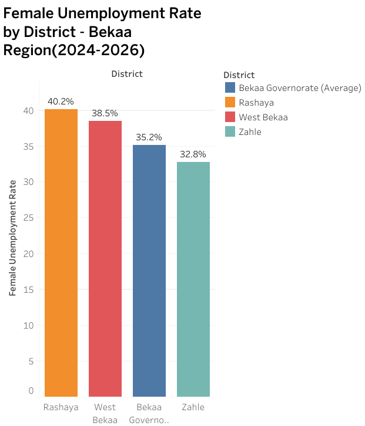
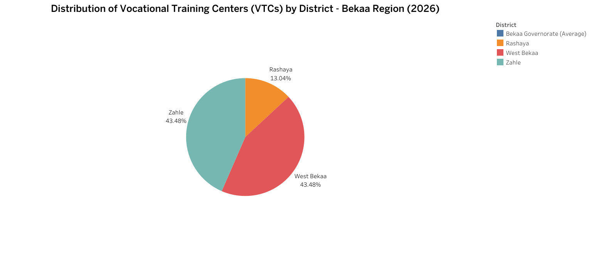
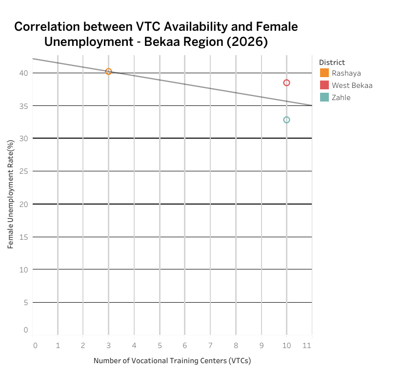

## Spatial Analysis in ArcMap

### Buffer Analysis

Buffer analysis was used to represent the approximate service areas around vocational training centers. The map helps identify communities that are closer to or farther from the available centers.

The Buffer map shows the approximate areas covered by the mapped vocational training centers. Areas with limited coverage may require better transportation, additional training services, or mobile training units.

### Kernel Density Heat Map

Kernel Density Estimation was used to visualize the concentration of vocational training centers. Stronger colors represent areas with a higher concentration of mapped centers, while weaker colors represent lower density.

.jpg)

The Heat Map highlights the spatial concentration of VTCs and helps identify areas with fewer available centers. It is a regional density visualization and should not be interpreted as an exact measure of the capacity or quality of each institution.

## Tableau Results

### Female Unemployment by District

This chart compares female unemployment indicators across the selected Bekaa districts and helps identify areas facing greater economic challenges for women.

### Distribution of Vocational Training Centers

This chart presents the distribution of the mapped vocational training centers across the study districts.

### Relationship Between VTC Availability and Female Unemployment

This scatter plot compares VTC availability with female unemployment in the project dataset. It shows an association between the two variables, but it does not prove that VTC availability alone causes changes in unemployment.

## Author and Copyright

© 2026 Rana Hani Yassin. All rights reserved.

This project is presented for educational and portfolio purposes. Please request permission before reproducing, modifying, or redistributing the original analysis, maps, text, or visualizations.

